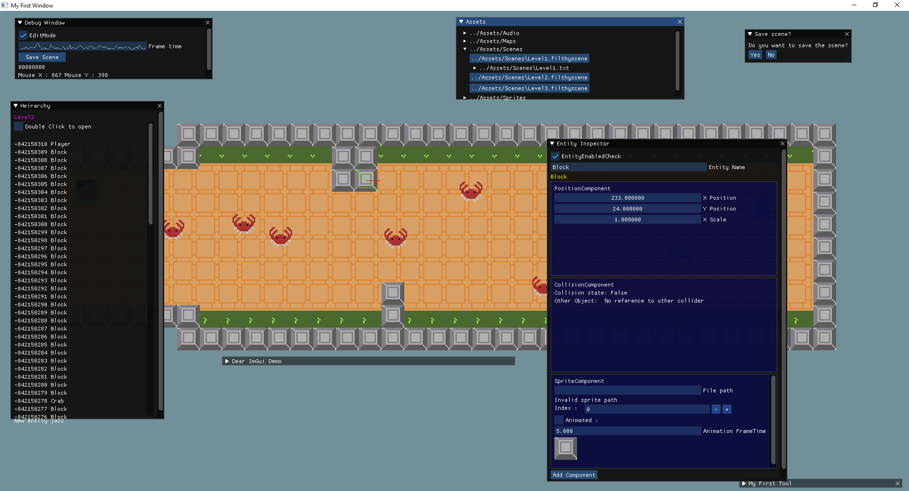
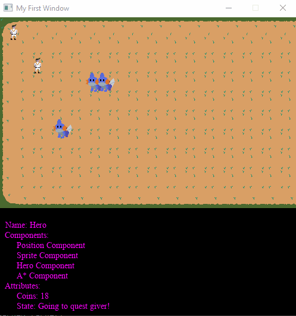
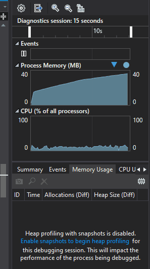

# The Filthy Engine
A University module turned part-time obsession.

The Filthy Engine is a 2D game engine, aimed towards making zelda-like games, and has been through a few iterations in the past year.

The first use of the filthy engine was making a small AI-driven scene utilising some A* pathfinding and state machines

This first use of The Filthy taught me a lot about the engine. Specifically, a lot of the flaws...

There have been some more small game prototypes using the filthy engine which were accidentally caught in a desktop cleaning purge.
You will always be remembered.

And that brings us to now. About 8 months into development on the day of writing, The Filthy Engine stands as the largest project I have ever undertaken, and it won't be getting smaller any time soon.

For a non-comprehensive feature list see below:

- Inspector & custom inspector writing
- Heirarchy
- FileTree
- Resource Management
- Scene Management
- Audio Management
- Input Management
- Entity Component System
- Animations
- Custom Component writing
- Debugging tools
- Probably a few more I can't think of.
